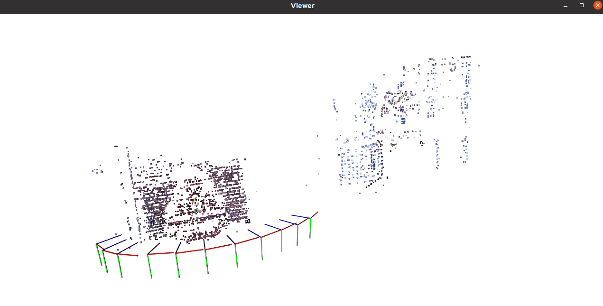

# Stereo SLAM

## 概述

简易SFM算法的实现，学习及存档使用。主要内容如下：

- 2D-2D：前两帧使用本质矩阵E三角化建立初始地图
- 3D-2D：后续每帧与上一帧的点匹配，通过PnP建立新地图点，帧间通过局部地图进行BA
- 最后对全局地图进行全局BA, 输出优化后的地图点

## 文件结构

```bash
├── CMakeLists.txt
├── include
│   ├── BA.h
│   ├── Camera.h
│   ├── common_include.h
│   ├── Frame.h
│   ├── Map.h
│   ├── MapPoint.h
│   └── SFM.h
├── README.md
└── src
    ├── BA.cpp
    ├── Camera.cpp
    ├── Frame.cpp
    ├── main.cpp
    ├── Map.cpp
    ├── MapPoint.cpp
    └── SFM.cpp
```

## 依赖库

- **Ubuntu20.04**
- **Eigen 3.3.7** ([link](https://eigen.tuxfamily.org/index.php?title=Main_Page))
- **FMT 10.2.1** ([link](https://github.com/fmtlib/fmt.git))
- **Sophus 1.22.10**([link](https://github.com/strasdat/Sophus))
- **OpenCV 4.8**([link](https://opencv.org/releases/))
- **PCL 1.10.0** 
- **Ceres 2.2.0**([link](http://ceres-solver.org/ceres-solver-2.2.0.tar.gz))

## 安装

```bash
1.Ubuntu20.04
# 自行安装

2.安装Eigen(version: 3.3.7)
sudo apt-get install libeigen3-dev

3.安装fmt(version: 10.2.1)
git clone https://github.com/fmtlib/fmt.git
cd fmt && mkdir build && cd build
cmake .. && make
sudo make install

4.安装Sophus(version: 1.22.10)
git clone https://github.com/strasdat/Sophus.git
cd Sophus && mkdir build && cd build
cmake .. && make
sudo make install

5.安装opencv(version: 4.8.0)
# 下载opencv4.8.0自行解压; 或: (git clone https://github.com/opencv/opencv.git && cd opencv && git checkout 4.8.0)
sudo apt-get install build-essential libgtk2.0-dev libgtk-3-dev libavcodec-dev libavformat-dev libjpeg-dev libswscale-dev libtiff5-dev
cd opencv && mkdir build && cd build
cmake -D CMAKE_BUILD_TYPE=Release -D OPENCV_GENERATE_PKGCONFIG=YES ..
make -j4
sudo make install

6.安装pcl(version: 1.10.0)
sudo apt install libpcl-dev		

7.安装ceres 2.2.0
# 下载ceres 2.2.0自行解压; http://ceres-solver.org/ceres-solver-2.2.0.tar.gz
sudo apt-get install libgoogle-glog-dev libgflags-dev
sudo apt-get install libatlas-base-dev
sudo apt-get install libeigen3-dev
sudo apt-get install libsuitesparse-dev
cd ceres-solver-2.2.0 && mkdir build && cd build
cmake ..
make -j3
make test
sudo make install

8.编译
git clone https://github.com/mazhuang1124/lite_sfm.git
cd lite_sfm 
cmake .. && make
./lite_sfm
# 默认为debug模式，开启cout、cv_imshow、pcl_viewer
# 可在CMakeLists.txt中注释对应行进行关闭
# 若报错[xcb] xcb_io.c:260: poll_for_event: Assertion `!xcb_xlib_threads_sequence_lost' failed.
# 可重新运行可执行文件，该报错为pcl_viewer偶发性的窗口启动失败
```

## 效果演示



## Acknowledgement

- [SLAM十四讲](https://github.com/gaoxiang12/slambook2)

- [sfm_learn](https://github.com/chengzhag/sfm_learn)
- [Sfm-python](https://github.com/adnappp/Sfm-python)
